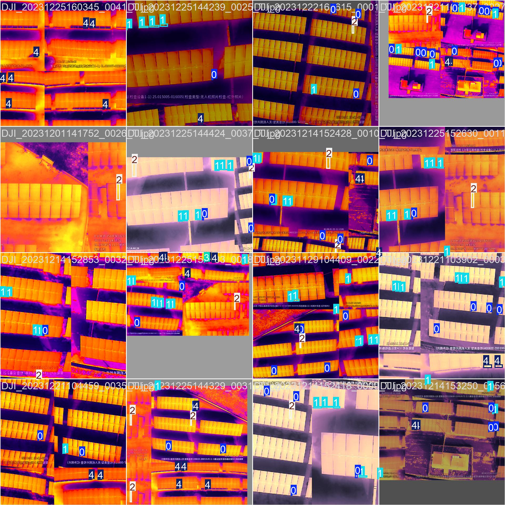
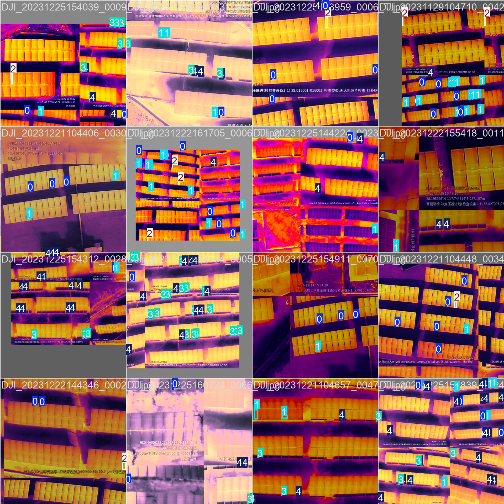
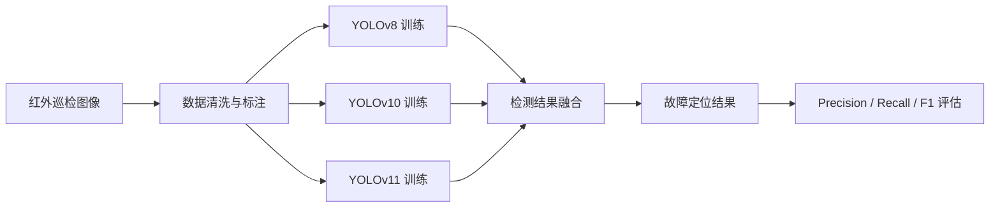
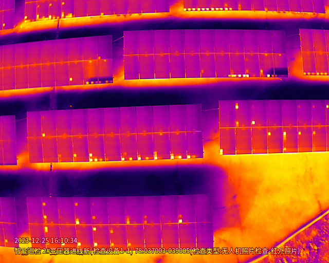
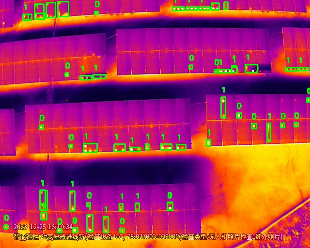
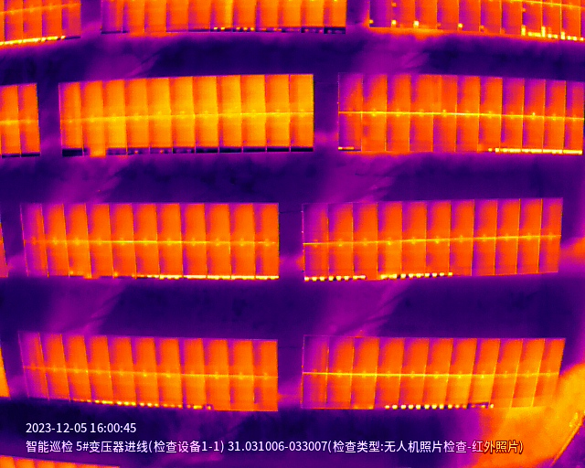
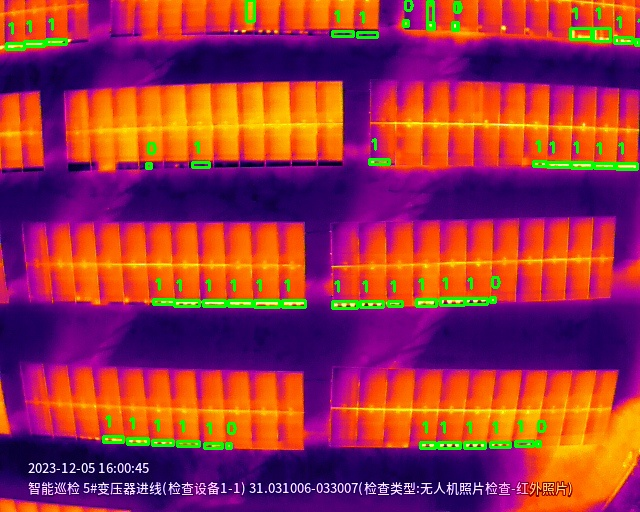
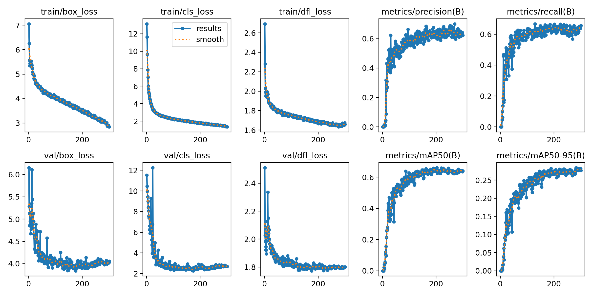
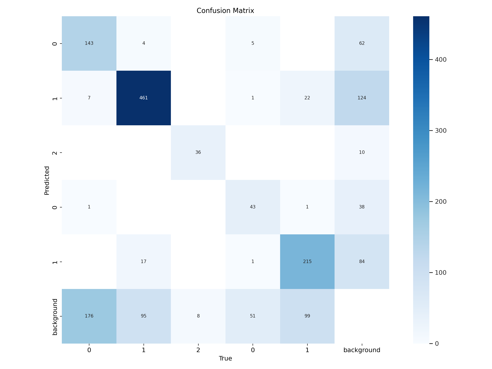

# 集成YOLO模型的光伏板红外图像故障检测研究

本项目面向光伏板红外热成像故障检测场景，基于 `YOLOv8`、`YOLOv10` 和 `YOLOv11` 构建多模型集成检测方案，实现对热斑、多热斑和二极管故障的自动识别与定位。项目源代码、训练数据组织方式、模型权重和部分实验结果均已保留在仓库中，适合继续复现、整理和二次开发。

## 项目总览

下面两张图展示了本项目训练数据在目标检测任务中的标注与学习目标，可作为 GitHub 首页顶部的直观效果图：

<table>
  <tr>
    <td align="center"><strong>训练样本可视化 1</strong></td>
    <td align="center"><strong>训练样本可视化 2</strong></td>
  </tr>
  <tr>
    <td></td>
    <td></td>
  </tr>
</table>

## 项目概览

- 任务类型：红外图像目标检测
- 应用场景：光伏板巡检、故障定位、无人机红外巡检辅助分析
- 核心方法：`YOLOv8 + YOLOv10 + YOLOv11` 检测结果融合
- 数据来源：光伏板组串红外热成像图片
- 故障类型：热斑、多热斑、二极管故障

根据项目报告，最终集成模型在测试中取得了：

| 指标 | 数值 |
| --- | ---: |
| Precision | 0.83 |
| Recall | 0.94 |
| F1-score | 0.88 |

## 项目背景

传统光伏板故障检测通常依赖人工巡检，存在效率低、主观性强、漏检率高的问题。红外热成像能够直接反映组件温度异常区域，但在实际巡检图像中，仍会受到光照、拍摄角度、图像质量和故障特征差异等因素影响。

本项目尝试将 YOLO 系列目标检测模型引入光伏板红外图像分析，并进一步通过集成学习整合多个模型的检测结果，以提升复杂场景下的鲁棒性和召回能力。

## 方法流程



项目中的集成策略主要思路是：

1. 使用三个独立训练好的 YOLO 模型分别对同一张图片进行检测。
2. 对检测框进行相似性判断，结合中心点距离、IoU 和类别标签过滤重复框。
3. 对相似检测结果取公共区域，减少误检与重复检测。
4. 使用真实标注统计 `TP / FP / FN`，计算 Precision、Recall 和 F1-score。

对应实现可参考 [datasets/test.py](datasets/test.py)。

## 数据集说明

根据项目报告与当前仓库内容：

- 原始数据规模：`1800+` 张光伏板红外热成像图像
- 清洗后保留：`783` 张有效图片
- 标注目标数：`790` 个故障实例
- 当前仓库划分：
  - 训练集：`599` 张
  - 验证集：`140` 张
  - 测试集：`44` 张

### 标注类别设计

报告中最初将明亮/黑暗图像中的故障分别细分标注，标签设计如下：

| 图像类别 | 故障类别 | 标签 |
| --- | --- | ---: |
| 清晰/明亮图片 | 热斑 | 0 |
| 清晰/明亮图片 | 多热斑 | 1 |
| 清晰/明亮图片 | 二极管故障 | 2 |
| 黑暗/底部偏暗图片 | 热斑 | 0 |
| 黑暗/底部偏暗图片 | 多热斑 | 1 |
| 黑暗/底部偏暗图片 | 二极管故障 | 2 |

在训练阶段，项目通过 `data.yaml` 对部分标签进行了合并映射，以降低同类故障在不同成像条件下的分布差异带来的影响。配置文件见 [datasets/data.yaml](datasets/data.yaml)。

## 效果展示

### 检测样例

<table>
  <tr>
    <td align="center"><strong>原始红外图像 1</strong></td>
    <td align="center"><strong>检测结果 1</strong></td>
  </tr>
  <tr>
    <td></td>
    <td></td>
  </tr>
  <tr>
    <td align="center"><strong>原始红外图像 2</strong></td>
    <td align="center"><strong>检测结果 2</strong></td>
  </tr>
  <tr>
    <td></td>
    <td></td>
  </tr>
</table>

### 训练过程

训练日志显示，随着迭代推进，损失函数整体下降，检测指标逐步趋于稳定。当前仓库保留了一次典型训练实验的结果图：

<p align="center">
  
</p>

### 混淆矩阵

<p align="center">
  
</p>

## 仓库结构

```text
yolo/
├─ datasets/
│  ├─ data.yaml                # 数据集配置
│  ├─ train.py                 # 模型训练脚本
│  ├─ test.py                  # 三模型集成测试与F1计算
│  ├─ data.py                  # 数据集划分脚本
│  ├─ model/
│  │  ├─ YOLOv8/best.pt
│  │  ├─ YOLOv10/best.pt
│  │  └─ YOLOv11/best.pt
│  ├─ runs/train/exp/          # 训练可视化结果
│  ├─ train/ val/ test/        # 图像与标签数据
├─ detect.py                   # 本地摄像头检测脚本
├─ app.py                      # Gradio 演示入口
├─ ultralytics/                # YOLO 相关源码
└─ README.md
```

## 环境配置

建议使用 Python 3.9 及以上版本。

```bash
pip install -r requirements.txt
```

如果你希望以可编辑模式安装，也可以使用：

```bash
pip install -e .
```

## 使用方法

### 1. 训练单个 YOLO 模型

当前训练脚本位于 [datasets/train.py](datasets/train.py)：

```bash
python datasets/train.py
```

该脚本当前使用了绝对路径，上传 GitHub 后建议先按你的本地环境修改以下内容：

- 模型初始权重路径
- `datasets/data.yaml` 路径
- 训练输出目录

### 2. 运行集成检测与评估

```bash
python datasets/test.py
```

该脚本会：

- 加载 `YOLOv8 / YOLOv10 / YOLOv11` 三个权重
- 对测试集逐张推理
- 执行检测框融合
- 输出带标注结果图
- 统计 `Precision / Recall / F1-score`

### 3. 摄像头实时检测

```bash
python detect.py
```

脚本会打开本地摄像头，在检测到目标后自动保存带标注图像。运行前同样需要先修改权重路径和结果保存路径。

### 4. 启动可视化界面

```bash
python app.py
```

`app.py` 基于 `Gradio`，可用于图像或视频输入的可视化推理演示。

## 训练配置

从 [datasets/runs/train/exp/args.yaml](datasets/runs/train/exp/args.yaml) 可见，本项目一次典型训练使用的关键参数如下：

| 参数 | 值 |
| --- | --- |
| `imgsz` | `640` |
| `epochs` | `300` |
| `batch` | `64` |
| `optimizer` | `SGD` |
| `close_mosaic` | `10` |
| `amp` | `True` |

报告中提到：模型在约 `300` 轮训练时效果较好，`mAP50` 最终稳定在 `0.68` 左右；当前仓库中的这份训练结果图对应实验的末期 `mAP50(B)` 约为 `0.64`，说明不同训练轮次和数据划分下会存在一定波动。

## 当前项目状态说明

这个仓库更像一份完整的课程/竞赛研究留档，保留了训练权重、数据集组织、实验结果与演示脚本，但仍有一些适合继续整理的地方：

- 多个脚本仍使用了 Windows 或 Linux 的绝对路径
- `data.yaml` 中的类别映射需要进一步补充注释
- `app.py` 目前更接近通用 YOLO Demo，而不是完全针对本课题定制
- 项目报告中的“图11 集成学习框架”等示意图尚未单独整理进仓库

这些都不影响你将其作为研究项目源码公开，但如果后续继续维护，建议逐步补齐。

## 研究结论

本项目围绕光伏板红外故障检测问题，结合 YOLO 系列模型的实时检测能力与集成学习的结果融合思路，完成了一个可训练、可推理、可评估的原型系统。实验表明，该方法能够较好地识别并定位红外图像中的典型故障区域，对光伏板智能巡检具有一定应用价值。

